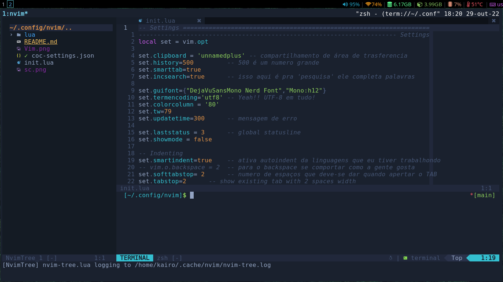

<p style="display: inline_block">

</p>
<hr>


* [Abrir O vim](#Abrir_o_Vim)
* [exit](#exit)
* [Movese](#Movese)
* [Atalhos](#Atalhos)
* [RegeExr vim](#RegeExr)
* [comando](#comandos)
* [set](#set)
* [Modos de editor](#Modos_do_editor)
* [inserção](#Inserção)
* [visual](#visual)
* [busca](#busca)
* [reposição](#reposição)
* [ESC manipulação de texto](#ESC_manipulação_de_texto)
* [Copia](#Copia)
* [Cola](#Cola)
* [Recorta](#Recorta)
* [Junta](#junta)
* [vim-emmet](#vim-emmet)
* [coc-explorer](#coc-explorer)


# Abrir_o_Vim
```
vim arquivo		abre o arquivo ou cria
vim arquivo +		abre com ocurso no final do arquivo
vim arquivo +8		abre com ocurso na linha 8
vim arquivo +/BSD	abre o arquivo na primeira palavra BSD
vim arquivo outro -o	abre colunas Horizontais
vim arquivo outro -O	abre colunas Verticais
vim -c ":%s/palavra/outra/g" arquivo
troca todas as palavras por outra sem o argumento g troca apenas a primeira ocorencia da palavra
```
# exit
```
:w salva
:q sai
:q! força saida
:wq
:x  sai e salva
:wa salva todos os arquivos abertos
:wqa sai e salva todos os arquivos abertos
```
# Movese
```
h j k l servem como cetas de direção
$ vai para o fim da linha
^ vai para o inicio da linha
gg vai para o inicio do arquivo
w pula para proxima palavra
b pula para pelavra anterior
e pula pro final de palavra
u desfaz as útimas mudanças
ggVG seleciona tudo, se aperta ==  indenta tudo
. repeti tudo o'que foi feito anterior mente
[ pula para frase anterior ] o inverso
{ pula pro paragrafo anterior } o inverso
```
# Atalhos
```
^n completar palavra
^p completa palavra
^r refazer
^e uma linha abaixo
^y uma linha acima
^f pagina abaixo
^b pagina acima
^d disindenta linha atual
^t indenta linha atual
^u apaga linha intera
^z sai(:stop), fg no terminal volta
^w+ aumenta espaço de janela
^w- diminui espaço de janela
^w= ingula espaço de janela
^wn abre uma nova janela
^ws abre o arquivo atual em horizontal
^wv abre o arquivo atual em vertical
^ww altera entre as janelas
^wq fecha o artquivo atual
^wc fecha a janela atual
^w h j k l mover para janela
```
## RegeExr
```
$ vai pro fim da linha
^ vai pro inicio da linha
:<comando>! forca comando
```
# comandos
```
:split [arquivo/caminho] abre um arquivo em nova janela horizontais
:split	:sp divide horizontais
:vsplit :vs divide vertical
:bn mudará para o próximo buffer.
:bp alterna para o buffer anterior em vez de avançar.
:bd Use este comando Vim ao fechar um buffer específico.
:ls lista de todos os buffers abertos.
:9,21w parte.txt	salva o arquivo da linha 9 a 21
:%s/nada/ninguem/g	troca as palavras nada por ninguem sem o g a apenas uma ocorencia
:u converte as palavras para minúsculo :U converte para maiúsculo
:8 ou  8G vai até a linha 8
:$ ou G vai para o final do arquivo
:1,$ s/substui/palavras
```
## set
```
:set autoindent ele autoindenta na sessao atual.
:set hlsearch detaca todos os termos encontrados (highlight).
:set nohtsearch desativa o hlsearch.
:set aw salva a cada alteração.
```
# Modos_do_editor
## inserção
```
Nºi o'que for escrito, repete o'que foi escrita depois de precionar ESC
i inserção de texto
s apaga uma o'que esta sobre o o curso
S apaga a linha
o cria uma linha embraco em baicho
O cria uma linha embraco em cima
a vai para frente do o curso
A vai para frente da linha
```
## visual
```
v seleção de texto
V seleção de linha
^v seleção em bloco
```
## busca
```
/ busca de padróes no texto
n localisa a próxima N anterior  * sobo
```
## reposição
```
R inserção sobreescrevendo
```
## ESC_manipulação_de_texto
### Copia
```
y copia oque esta sobre o curso
yy copia toda a linha
yw copia até o fim da palavra
y$ copia da posicao atual ate o fim da linha
y2j copia mais duas linhas pra baicho
"+y copia para a área de transferencia
```
### Cola
```
p cola
[p cola antes do curso ]P faz o inverso
"+gp cola da area detranferencia
```
### Recorta
```
x recorta sob o cursor X antes do cursor
dd recorta toda a linha
d recorta até for levado
D exclui a tudo na linha
0 excluir tudo da posição atual do cursor até o início da linha.
dgg excluir tudo da posição atual do seu cursor até o início do arquivo.
dG apaga tudo, desde a posição atual do seu cursor até o final do arquivo.
dj recorta 2 linhas para baicho
dk recorta 2 linhas para cima
dw recorta ate o fim da palavra
d+ recorta da reposição atual
5db apaga 5 palavras para trás da reposição do cursor
```
### Junta
```
J junta duas linhas
```
## vim-emmet

**`div`**

```html
<div></div>
```

**`div#header`**

```html
<div id="header"></div>
```

**`div.align-left#header`**

```html
<div id="header" class="align-left"></div>
```

**`div#header + div#footer`**

```html
<div id="header"></div>
<div id="footer"></div>
```

**`#menu > ul`**

```html
<div id="menu">
<ul></ul>
</div>
```

**`#menu > h3 + ul`**

```html
<div id="menu">
<h3></h3>
<ul></ul>
</div>
```

**`#header > h1{Welcome to our site}`**

```html
<div id="header">
<h1>Welcome to our site</h1>
</div>
```

**`a[href=index.html]{Home}`**

```html
<a href="index.html">Home</a>
```

**`ul > li*3`**

```html
<ul>
<li></li>
<li></li>
<li></li>
</ul>
```

**`ul > li.item-$*3`**

```html
<ul>
<li class="item-1"></li>
<li class="item-2"></li>
<li class="item-3"></li>
</ul>
```

**`ul > li.item-$*3 > strong`**

```html
<ul>
<li class="item-1"><strong></strong></li>
<li class="item-2"><strong></strong></li>
<li class="item-3"><strong></strong></li>
</ul>
```

**`table > tr*2 > td.name + td*3`**

```html
<table>
<tr>
<td class="name"></td>
<td></td>
<td></td>
<td></td>
</tr>
<tr>
<td class="name"></td>
<td></td>
<td></td>
<td></td>
</tr>
</table>
```

**`#header > ul > li < p{Footer}`**

```html
<!-- The < symbol goes back up the parent; i.e., the opposite of >. -->
<div id="header">
<ul>
<li></li>
</ul>
<p>Footer</p>
</div>
```

## coc-explorer

```

"<tab>": "Menu de ação",
"gk": ["esperar", "anterior expansível"],
"gj": ["esperar", "expansível Próximo"],
"h": ["esperar", "recolher"],
"l": ["esperar", "expansível?", "expandir", "abrir"],
"J": ["esperar", "alternar Seleção", "normal:j"],
"K": ["esperar", "alternar Seleção", "normal:k"],
"gl": ["esperar", "expandir:recursivo"],
"gh": ["esperar", "recolher:recursivo"],

"o": ["esperar", "expandido?", "recolher", "expandir"],
"<cr>": ["esperar", "expansível?", "cd", "abrir"],
"e": "abrir",
"s": "abrir:dividir",
"E": "abrir:vsplit",
"t": "abrir: aba",
"<bs>": ["esperar", "ir para pai"],
"gs": ["esperar", "reveal:selecionar"],
"il": "preview:rotulagem",
"ic": "visualização:conteúdo",
"Il": "preview Ao passar o mouse:toggle:labeling",
"Ic": "preview Ao passar o mouse:toggle:content",
"II": "visualização ao passar o mouse: desabilitar",

"yp": "copiar caminho de arquivo",
"yn": "copiar nome do arquivo",
"yy": "copiar arquivo",
"dd": "cortar arquivo",
"p": "colar arquivo",
"df": "excluir",
"dF": "excluir para sempre",

"a": "adicionar arquivo",
"A": "adicionar diretório",
"r": "renomear",

"zh": "alternar Oculto",
"g<ponto>": "alternar Oculto",
"R": "atualizar",

"?": "ajuda",
"q": "sair",
"<esc>": "esc",
"X": "execução do sistema",
"gd": "lista tDrive",

"f": "pesquisar",
"F": "pesquisa recursiva",

"gf": "ir para Fonte:arquivo",
"gb": "ir para Fonte:buffer",

"[[": ["esperar", "fonte anterior"],
"]]": ["esperar", "fonte Próxima"],

"[i": ["esperar", "recuar anterior"],
"]i": ["esperar", "recuar próximo"],

"[m": ["esperar", "marcar Prev:modificado"],
"]m": ["esperar", "marcar Próximo:modificado"],

"[d": ["wait", "mark Prev:diagnostic Error:diagnostic Warning"],
"]d": ["wait", "mark Next:diagnostic Error:diagnostic Warning"],
"[D": ["esperar", "marcar Prev:erro de diagnóstico"],
"]D": ["wait", "mark Next:diagnostic Error"],

"[c": ["esperar", "marcar Prev:git"],
"]c": ["wait", "mark Next:git"],
"<<": "git Stage",
">>": "git Unstage"

```

<p style="display: inline_block">

</p>
